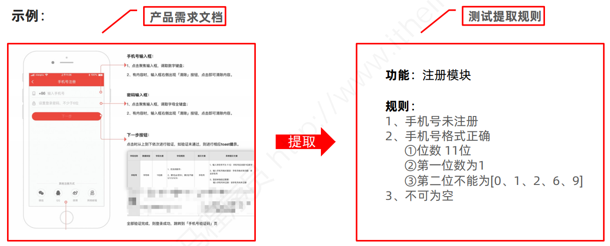
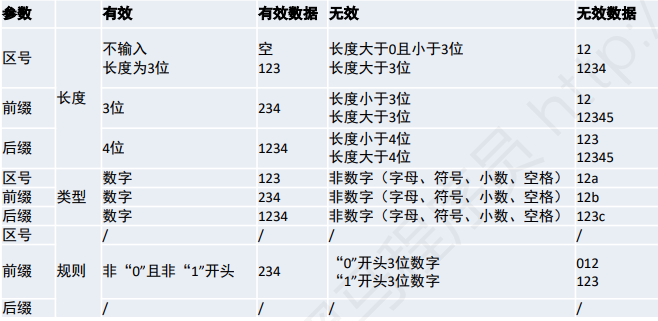
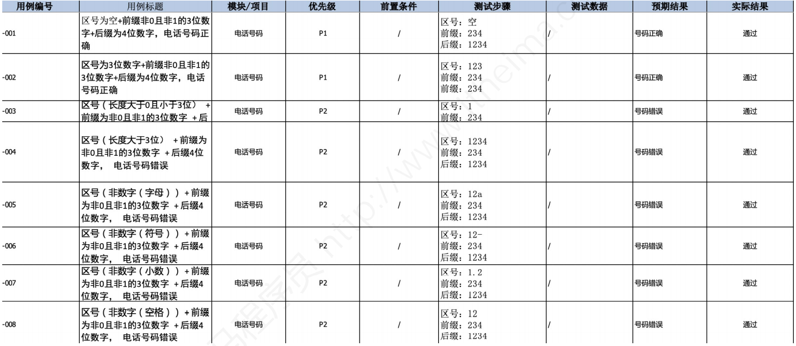

# 软件测试入门

## 一、测试怎么做

### 1、需求分析

说明：根据产品需求文档，提取出规则要求。

为什么要进行提取规则要求？

- 明确软件有哪些功能和要求

- 为设计测试点做准备

### 2、设计测试点

测试点：要进行验证的点，根据需求规则设计测试点。

规则： 

1、手机号未注册 

2、手机号格式正确 

① 位数 11位 

②第一位数为1 

③第二位不能为[0、1、2、6、9] 

3、不可为空 

测试点示例：

- 正确： ① 11位+未注册+正确格式（第一位1、第二位3） ② ... 

- 错误： ① 手机号已注册 ② ... 

为什么要设计测试点？

- 防止测试时有遗漏
- 为编写测试用例做准备

### 3、测试用例

将测试点转为测试执行的文档。

为什么要这么编写用例？

- 指导测试点正确测试实施
- 为执行测试做准备

### 4、用例执行

说明：执行用例就是执行测试。

测试步骤执行结果 = 预期结果 通过

测试步骤执行结果 != 预期结果 不通过

### 5、缺陷管理

说明：当执行用例结果和预期结果不符时为缺陷，就需要对缺陷进行管理

为什么需要对缺陷进行管理？

-  测试的目的就是减少软件缺陷（提交缺陷->等待修复->验证缺陷）
- 为测试报告做准备

### 6、测试报告

说明：对于本次执行测试缺陷进行分析统计，对于本次测试实施进行总结。

 主要内容：

 1、缺陷统计 

2、缺陷分析 

3、遗留缺陷 

4、测试总结

### 总结

测试怎么做： 

① 分析需求 – 明确需求，**梳理规则**

 ② 针对需求设计测试点 – **测试点可以根据设计方法进行 高效设计**

③ 针对测试点编写测试用例 

④ 执行测试用例- 根据用例文档**测试步骤**执行，**对比**预期结果，来决定用例执行是否通过。 

⑤ 缺陷管理-提交缺陷、跟踪缺陷、**验证缺陷** 

⑥ 总结测试报告- **统计缺陷**，总结本次测试执行为下次测试积累经验

## 二、测试用例

### 1、什么是测试用例

用例：用户使**用**的案**例**

测试用例：执行测试时用户案例

英文：Test Case

### 2、为什么要测试用例

目的：保证测试点的正确执行

### 3、用例编写格式

说明：用例编写格式一般由八大要素组成

| 用例编号 | 用例标题 | 模块/项目 | 前置条件 | 优先级 | 测试步骤 | 测试数据 | 预期结果 |
| :------: | :------: | :-------: | :------: | :----: | :------: | :------: | :------: |
|          |          |           |          |        |          |          |          |

### 4、用例编写格式

### 5、编写示例

微信登录测试点：

1、登陆成功

2、密码错误，登录失败

### 总结

1. 用例：用户使用的案例

2. 目的：保证测试点正确执行

3. 格式：八大要素 

   ①用例编号

   ②用例标题 

   ③项目模块 

   ④前置条件 

   ⑤优先级 

   ⑥操作步骤 

   ⑦测试数据 

   ⑧预期结果

## 三、设计测试点方法

### 1、等价类划分法

#### 1.1 说明 | 分类 | 步骤

#### 1.2 案例

**需求：**验证QQ账号的合法性 

**要求:** 6~10位自然数

**步骤：** 

1、明确需求 ① 内容：自然数（0、1、2、....）

​							 ② 长度：6-10位 

2、确定有效和无效等价类 

有效等价：6-10位 

无效等价：①小于6位 	②大于10位 	③非自然数 

3、提取数据编写用例 

有效等价：8位（12345678） 

无效等价：①小于6位-5位（12345） ②大于10位-11位（12345678901）③非自然数

**用例：**

|    用例编号    |        用例标题        | 模块/项目 | 前置条件 | 优先级 |       测试步骤        |  测试数据   | 预期结果 |
| :------------: | :--------------------: | :-------: | :------: | :----: | :-------------------: | :---------: | :------: |
| q_account_001  |   QQ账号正确（8位）    |   账号    |    p1    |   /    | 1.启动QQ 2.输入QQ帐号 |  12345678   | 账号正确 |
| q_account_002  |   QQ账号错误（5位）    |   账号    |    p1    |   /    | 1.启动QQ 2.输入QQ帐号 |    12345    | 账号错误 |
| qq_account_003 |   QQ账号错误（11位）   |   账号    |    p1    |   /    | 1.启动QQ 2.输入QQ帐号 | 12345678901 | 账号错误 |
| qq_account_004 | QQ账号错误（非自然数） |   账号    |    p1    |   /    | 1.启动QQ 2.输入QQ帐号 |  a12345678  | 账号错误 |

#### 1.3 适用场景

- 针对：需要有大量数据测试输入，但是没法穷举测试的地方。 

  - 输入框 

  - 下拉列表
  - 单选复选框

- 典型代表：页面输入框类测试。

#### 1.4 用例执行

##### 1.4.1 执行用例

1. 当执行结果和预期结果不一致，则为缺陷。 
2. 发现缺陷需要进行缺陷管理（提交->开发修复->测试验证->关闭缺陷）。 

##### 1.4.2 执行结果

|    用例编号    |        用例标题        | 模块/项目 | 前置条件 | 优先级 |       测试步骤        |  测试数据   | 预期结果 | 实际结果 |
| :------------: | :--------------------: | :-------: | :------: | :----: | :-------------------: | :---------: | :------: | :------: |
| q_account_001  |   QQ账号正确（8位）    |   账号    |    p1    |   /    | 1.启动QQ 2.输入QQ帐号 |  12345678   | 账号正确 |   通过   |
| q_account_002  |   QQ账号错误（5位）    |   账号    |    p1    |   /    | 1.启动QQ 2.输入QQ帐号 |    12345    | 账号错误 |  不通过  |
| qq_account_003 |   QQ账号错误（11位）   |   账号    |    p1    |   /    | 1.启动QQ 2.输入QQ帐号 | 12345678901 | 账号错误 |  不通过  |
| qq_account_004 | QQ账号错误（非自然数） |   账号    |    p1    |   /    | 1.启动QQ 2.输入QQ帐号 |  a12345678  | 账号错误 |   通过   |

#### 1.5 练习

**需求：**验证某城市电话号码正确性 

**要求：** 

1. 区号:空或者是三位数字

2. 前缀码:非“0”且非“1”开头的三位数字
3.  后缀码:四位数字

##### 1.5.1 编写用例

1. 明确需求：

2. 等价类划分：

3. 用例

##### 1.5.2 执行用例

用例结果：

