# 软件测试入门

## 一、测试怎么做

### 1、需求分析

说明：根据产品需求文档，提取出规则要求。

为什么要进行提取规则要求？

- 明确软件有哪些功能和要求

- 为设计测试点做准备

### 2、设计测试点

测试点：要进行验证的点，根据需求规则设计测试点。

规则： 

1、手机号未注册 

2、手机号格式正确 

① 位数 11位 

②第一位数为1 

③第二位不能为[0、1、2、6、9] 

3、不可为空 

测试点示例：

- 正确： ① 11位+未注册+正确格式（第一位1、第二位3） ② ... 

- 错误： ① 手机号已注册 ② ... 

为什么要设计测试点？

- 防止测试时有遗漏
- 为编写测试用例做准备

### 3、测试用例

将测试点转为测试执行的文档。

为什么要这么编写用例？

- 指导测试点正确测试实施
- 为执行测试做准备

### 4、用例执行

说明：执行用例就是执行测试。

测试步骤执行结果 = 预期结果 通过

测试步骤执行结果 != 预期结果 不通过

### 5、缺陷管理

说明：当执行用例结果和预期结果不符时为缺陷，就需要对缺陷进行管理

为什么需要对缺陷进行管理？

-  测试的目的就是减少软件缺陷（提交缺陷->等待修复->验证缺陷）
- 为测试报告做准备

### 6、测试报告

说明：对于本次执行测试缺陷进行分析统计，对于本次测试实施进行总结。

 主要内容：

 1、缺陷统计 

2、缺陷分析 

3、遗留缺陷 

4、测试总结

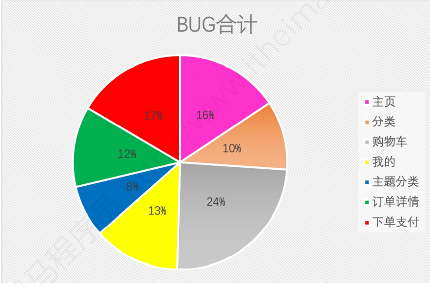

### 总结

测试怎么做： 

① 分析需求 – 明确需求，**梳理规则**

 ② 针对需求设计测试点 – **测试点可以根据设计方法进行 高效设计**

③ 针对测试点编写测试用例 

④ 执行测试用例- 根据用例文档**测试步骤**执行，**对比**预期结果，来决定用例执行是否通过。 

⑤ 缺陷管理-提交缺陷、跟踪缺陷、**验证缺陷** 

⑥ 总结测试报告- **统计缺陷**，总结本次测试执行为下次测试积累经验

## 二、测试用例

### 1、什么是测试用例

用例：用户使**用**的案**例**

测试用例：执行测试时用户案例

英文：Test Case

### 2、为什么要测试用例

目的：保证测试点的正确执行

### 3、用例编写格式

说明：用例编写格式一般由八大要素组成

| 用例编号 | 用例标题 | 模块/项目 | 前置条件 | 优先级 | 测试步骤 | 测试数据 | 预期结果 |
| :------: | :------: | :-------: | :------: | :----: | :------: | :------: | :------: |
|          |          |           |          |        |          |          |          |

### 4、用例编写格式

### 5、编写示例

微信登录测试点：

1、登陆成功

2、密码错误，登录失败

### 总结

1. 用例：用户使用的案例

2. 目的：保证测试点正确执行

3. 格式：八大要素 

   ①用例编号

   ②用例标题 

   ③项目模块 

   ④前置条件 

   ⑤优先级 

   ⑥操作步骤 

   ⑦测试数据 

   ⑧预期结果

## 三、设计测试点方法

### 1、等价类划分法

#### 1.1 说明 | 分类 | 步骤

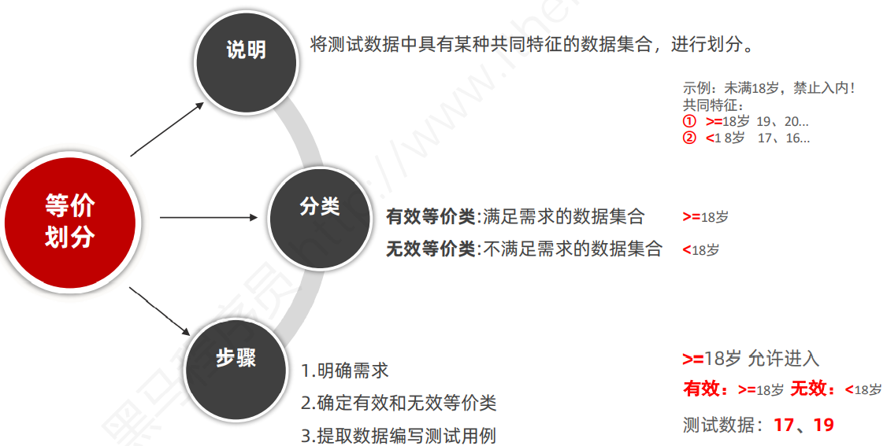

#### 1.2 案例

**需求：**验证QQ账号的合法性 

**要求:** 6~10位自然数

**步骤：** 

1、明确需求 ① 内容：自然数（0、1、2、....）

​							 ② 长度：6-10位 

2、确定有效和无效等价类 

有效等价：6-10位 

无效等价：①小于6位 	②大于10位 	③非自然数 

3、提取数据编写用例 

有效等价：8位（12345678） 

无效等价：①小于6位-5位（12345） ②大于10位-11位（12345678901）③非自然数

**用例：**

|    用例编号    |        用例标题        | 模块/项目 | 前置条件 | 优先级 |       测试步骤        |  测试数据   | 预期结果 |
| :------------: | :--------------------: | :-------: | :------: | :----: | :-------------------: | :---------: | :------: |
| q_account_001  |   QQ账号正确（8位）    |   账号    |    p1    |   /    | 1.启动QQ 2.输入QQ帐号 |  12345678   | 账号正确 |
| q_account_002  |   QQ账号错误（5位）    |   账号    |    p1    |   /    | 1.启动QQ 2.输入QQ帐号 |    12345    | 账号错误 |
| qq_account_003 |   QQ账号错误（11位）   |   账号    |    p1    |   /    | 1.启动QQ 2.输入QQ帐号 | 12345678901 | 账号错误 |
| qq_account_004 | QQ账号错误（非自然数） |   账号    |    p1    |   /    | 1.启动QQ 2.输入QQ帐号 |  a12345678  | 账号错误 |

#### 1.3 适用场景

- 针对：需要有大量数据测试输入，但是没法穷举测试的地方。 

  - 输入框 

  - 下拉列表
  - 单选复选框

- 典型代表：页面输入框类测试。

#### 1.4 用例执行

##### 1.4.1 执行用例

1. 当执行结果和预期结果不一致，则为缺陷。 
2. 发现缺陷需要进行缺陷管理（提交->开发修复->测试验证->关闭缺陷）。 

##### 1.4.2 执行结果

|    用例编号    |        用例标题        | 模块/项目 | 前置条件 | 优先级 |       测试步骤        |  测试数据   | 预期结果 | 实际结果 |
| :------------: | :--------------------: | :-------: | :------: | :----: | :-------------------: | :---------: | :------: | :------: |
| q_account_001  |   QQ账号正确（8位）    |   账号    |    p1    |   /    | 1.启动QQ 2.输入QQ帐号 |  12345678   | 账号正确 |   通过   |
| q_account_002  |   QQ账号错误（5位）    |   账号    |    p1    |   /    | 1.启动QQ 2.输入QQ帐号 |    12345    | 账号错误 |  不通过  |
| qq_account_003 |   QQ账号错误（11位）   |   账号    |    p1    |   /    | 1.启动QQ 2.输入QQ帐号 | 12345678901 | 账号错误 |  不通过  |
| qq_account_004 | QQ账号错误（非自然数） |   账号    |    p1    |   /    | 1.启动QQ 2.输入QQ帐号 |  a12345678  | 账号错误 |   通过   |

#### 1.5 练习

**需求：**验证某城市电话号码正确性 

**要求：** 

1. 区号:空或者是三位数字

2. 前缀码:非“0”且非“1”开头的三位数字
3.  后缀码:四位数字

##### 1.5.1 编写用例

1. 明确需求：

2. 等价类划分：

3. 用例

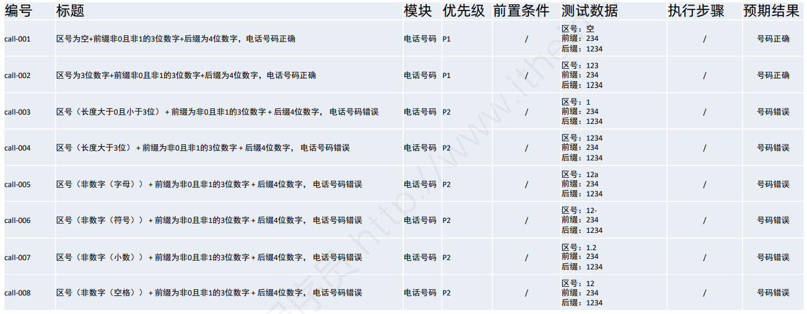

##### 1.5.2 执行用例

用例结果：

### 2、 边界值分析法

#### 2.1 边界范围节点 

说明：选取正好等于、刚好大于、刚好小于边界的值作为测试数据

- 上点：边界上的点(正好等于) 红色
- 离点：距离上点最近的点(刚好大于、刚好小于) 黄色
- 内点：范围内的点(区间范围内的数据) 蓝点 边界值分析方法 

#### 2.2 边界值法设计用例步骤

1. 明确需求 
2. 确定有效和无效等价类 
3. 确定边界范围值 
4. 提取数据编写测试用例

#### 2.3 案例

**需求：**通过边界值法验证标题长度的合法性 

**要求：**标题长度大于0，小于等于30个字符 

0< 标题长度 <=30  

扩展: 

开闭区间表达 (0,30] 

①开区间：不包含点 （大于 、小于） 使用小括号表达 

②闭区间：包含点（大于等于、小于等于）使用中括号表达 

**优化：**

- 结论:7个优化为5个点
- 上点:必选(不考虑区间开闭)
- 内点:必选(建议选择中间范围)
- 离点:开内闭外(开区间选择内部离点，闭区间选择外部离点）

#### 2.4使用场景

- 在等价类的基础上针对有边界范围的测试数据输入的地方(重点关注边界)
- 常见词语描述:大小、尺寸、重量、最大、最小、至多、至少等修饰词语
- 典型代表:有边界范围的输入框类测试

#### 2.5用例执行

执行结果：

#### 2.6练习

**需求：**通过边界值法验证QQ号码的合法性 

**要求：**6~10位自然数

##### 2.6.1编写用例

1. 明确需求

2. 等价类划分

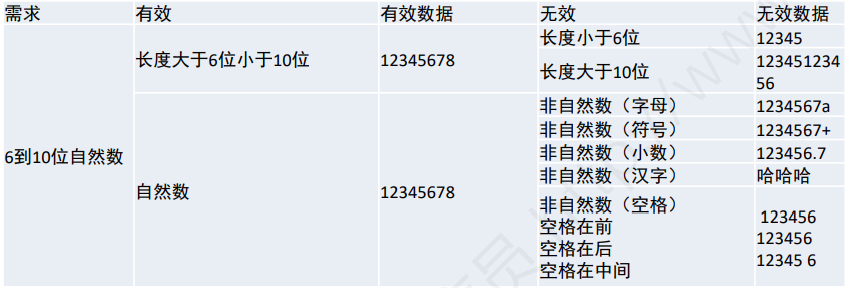

3. 确定边界范围

4. 用例

##### 2.6.2 执行用例

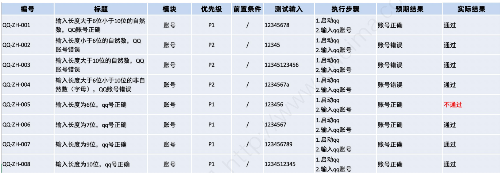

### 3、判定表法

#### 3.1 为什么使用判定表法

- 案例: 验证“若用户欠费或者关机，则不允许主被叫”功能的测试
- 说明：
  - 等价类边界值分析法主要关注单个输入类条件的测试
  - 并未考虑输入条件之间的各种组合、输入条件与输出结 果之间有相互制约关系的测试。

#### 3.2 判定表是什么

**定义：**是一种以表格形式表达多条件逻辑判断的工具

**组成：**

- 条件桩：列出问题中的所有条件，列出条件的次序无关紧要。
- 动作桩：列出问题中可能采取的操作，操作的排列顺序没有约束。
- 条件项：列出条件对应的取值，所有可能情况下的真假值。 
- 动作项：列出条件项的、各种取值情况下应该采取的动作结果。

**规则:** 

- 判定表中贯穿条件项和动作项的一列就是一条规则 
-  假设有n个条件，每个条件的取值有两个(0,1)，全组合有2的n次方种规则

#### 3.3 判定表法设计用例步骤

1、明确需求 

2、画出判定表 1）、列出条件桩和动作桩 

​									2）、填写条件项，对条件进行全组合 

​									3）、根据条件项的组合确定动作项 

​									4）、简化、合并相似规则(有相同的动作)

3、根据规则编写测试用例

#### 3.4 案例

**规则：** 

1） 如果金额大于500元，又未过期，则发出批准单和提货单;  

2）如果金额大于500元，但过期了，则不发批准单与提货单; 

3）如果金额小于等于500元，则不论是否过期都发出批准单和提货单;  

4）在过期的情况下不论金额大小还需要发出通知单。

#### 3.5 使用场景

- 有多个输入条件，多个输出结果，输入条件之间有组合关系，输入条件和输出结果之间有依赖(制约)关系
- 判定表一般适用于条件组合数量较少的情况(比如4个条件以下)

#### 3.6 用例执行

#### 3.7 练习

##### 3.7.1编写用例

1、明确需求

1）、输入的第一列字符必须是A或B 

2）、第二列字符必须是一个数字 

3）、如果第一列字符不正确，则给出信息L 

4）、如果第二列字符不正确，则给出信息M 

5）、如果两列字符输入正确，则修改文件成功

2、判定表

3、用例

##### 3.7.2 执行用例

### 4、场景法

#### 4.1 介绍

**说明：** 

- 场景法也可以叫流程图法，是用流程图描述用户的使用场景，然后通过覆盖流程路径来设计测试用例。

**意义：** 

- 用户使用角度:用户平时使用的不是单个功能，而是多个功能组合起来进行使用
- 测试人员角度:平时测试的都是单个功能点进行测试，容易忽略多个功能的组合测试

#### 4.2 案例

**ATM机取款流程：**

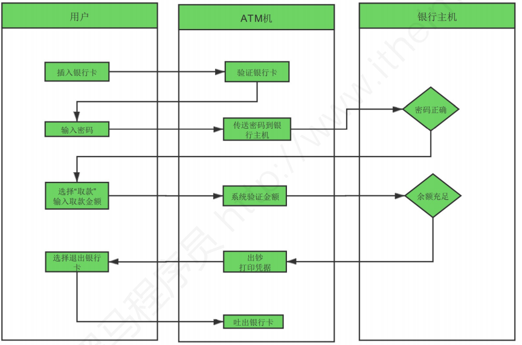

**ATM机取款流程--流程图：**

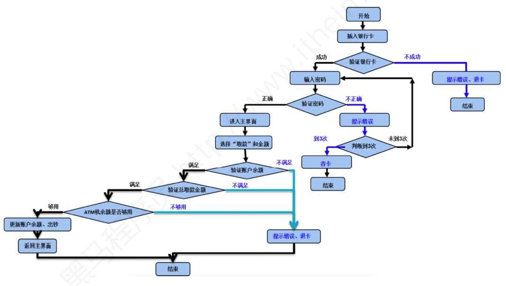

**用例：**

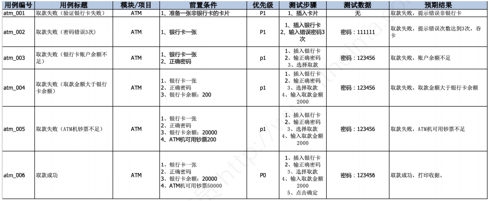

#### 4.3 使用场景

根据实际的应用场景，来测试业务用例，可以使用场景法

#### 4.4用例执行

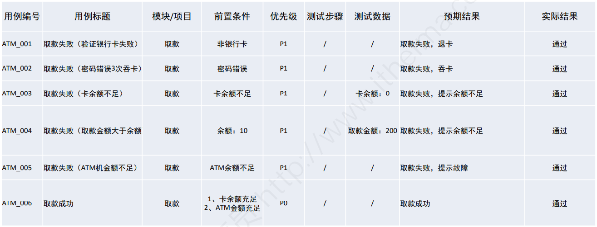

## 四、缺陷管理

### 1、缺陷介绍

#### 1.1 缺陷的定义

软件在使用过程中存在的任何问题都叫软件的缺陷，简称bug。

#### 1.2缺陷的判定标准

**少功能** —— 软件未实现需求(规格)说明书中明确要求的功能。

**功能错误** —— 软件出现了需求(规格)说明书中指明不应该出现的错误。 

**多功能** —— 软件实现的功能超出需求(规格)说明书指明的范围。 

**隐形功能错误** —— 软件未实现需求(规格)说明书中虽未明确指明但应该实现的要求。 

**不易使用** —— 软件难以理解,不易使用,运行缓慢,用户体验不好。

#### 1.3 缺陷产生的原因

- 需求阶段：需求描述不易理解，有歧义、错误等
- 设计阶段：设计文档存在错误或者缺陷
- 编码阶段：代码出现错误
- 运行系统：软硬件系统本身故障导致软件缺陷

#### 1.4 软件缺陷的生命周期

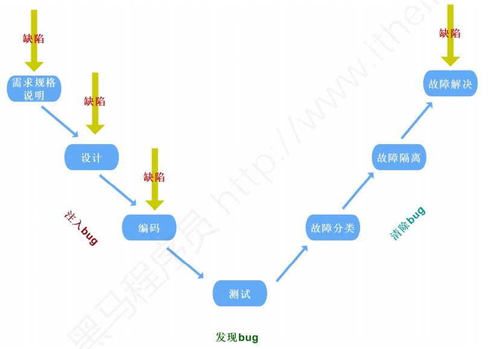

#### 1.5 软件缺陷类型

### 2、缺陷编写

#### 2.1 缺陷的核心内容

- 缺陷的标题：描述缺陷的核心问题
- 缺陷的预置条件：缺陷产生的前提
- 缺陷的复现步骤：复现缺陷的过程
- 缺陷的预期结果：希望得到的结果
- 缺陷的实际结果：实际得到的结果
- 缺陷的必要附件：图片、日志等信息（证据）

#### 2.2 缺陷描述

| 缺陷ID | 缺陷标题 | 所属模块 | 预置条件 | 严重程度 | 预期结果 | 实际结果 | 复现步骤 | 附件 |
| ------ | -------- | -------- | -------- | -------- | -------- | -------- | -------- | ---- |
|        |          |          |          |          |          |          |          |      |

案例：

#### 2.3 缺陷的跟踪流程

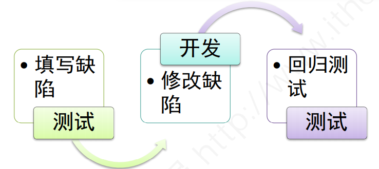

#### 2.4 缺陷的提交流程

主流程：提交缺陷（测试）->分配缺陷（缺陷提谁）->处理缺陷 （开发）->回归测试（测试）->关闭缺陷（测试）

#### 2.5 缺陷提交要素

- 缺陷报告编号：缺陷的唯一性标志

- 严重程度：

  - 严重（S1）：主功能
  - 一般（S2）：次要功能
  - 微小（S3）：易用性、界面
  - 建议（S4）：建议性问题

- 缺陷优先级：
  - Priority 0：24小时之内解决
  - Priority 1：发布前必须修复
  - Priority 2：可以在下一个版本中修复
- Bug类型：代码错误、兼容性问题、设计缺陷、性能问题
- 缺陷状态：
  - New：新建
  - Open：打开
  - Closed：关闭
  - Postponed：延期

#### 2.6 提交缺陷注意事项

可重现：缺陷可以复现

唯一性：一个缺陷上报一个问题

规范性：符合公司或者项目要求

### 3、缺陷管理工具

#### 3.1 禅道的介绍

地址：https://www.zentao.net/index.mhtml

特点：

- 国产、免费、开源、简单、轻量级
- 三管融合（产品管理、项目管理、质量管理）

#### 3.2 禅道的使用用户

三权分立：

- 产品部门——构想者
- 研发部门——执行者
- 测试部门——保证者

四角协同：

- 产品经理
- 项目经理
- 研发团队
- 测试团队

#### 3.3 禅道使用流程

管理用例 --> 创建用例 --> 评审用例 --> 执行用例

管理缺陷 --> 缺陷创建 --> 缺陷跟踪 --> 缺陷验证

#### 3.4 禅道管理用例

新建用例：

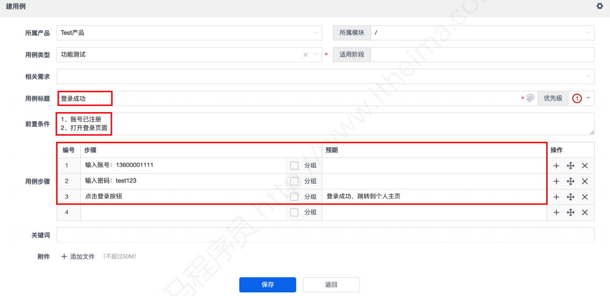

#### 3.5 禅道管理缺陷

提交Bug：

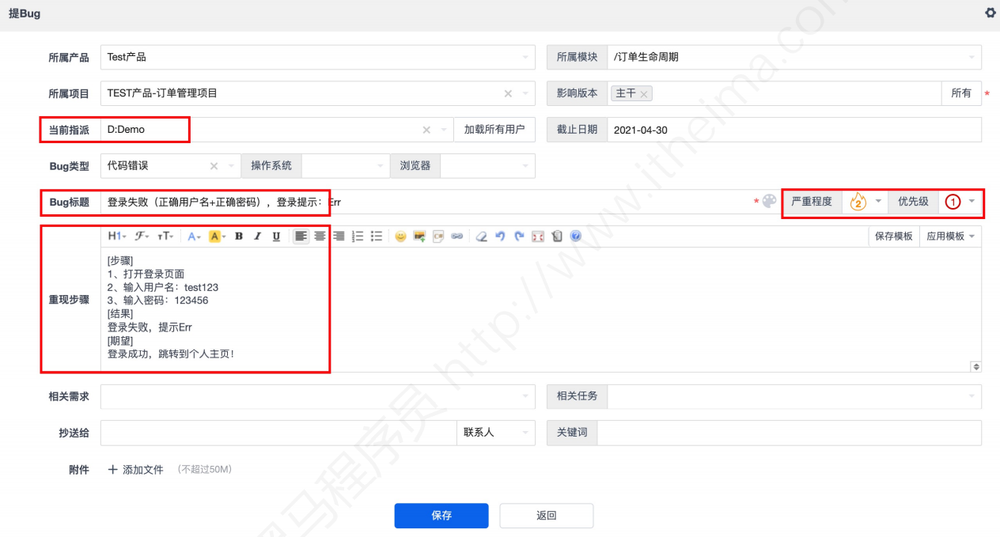

**注：**重现步骤里建议把[前置条件]写上。

## 五、抓包

### 1、为什么要抓包

- 功能测试时跳过ui界面验证，验证后端程序处理能力。 
  - （如：请求支付100元，通过抓包修改请求价格0.1元，查看后端程序是否能正常处理）
- 分析前端bug还是后端bug。 
  - （如：ui显示数据错误，提交bug时需要指定提交人，那是提交给前端开发还是后端开发呢？）
-  弱网测试 
  - （如：app应用模拟4G、3G网络）
- 接口测试时，缺乏接口描述文档，需要抓包获取。 
  - （如：查看支付宝请求信息）

### 2、什么事抓包

**说明：**通过工具抓取前端与后端的通信内容。

### 3、需要掌握哪些知识

1. 抓包操作（HTTP、HTTPS）
2. 断点操作-拦截修改（请求、响应）
3. 弱网测试

### 4、学习抓包工具

1、fiddler（windows ）断点、弱网、录制请求和响应 

2、Charles (mac、windows) 断点、弱网、录制请求和响应 

3、浏览器开发者工具 (查看请求和响应首选) 

**注：**入门抓包工具，使用Charles或fiddler都可以

### 5、学习

> 另开笔记学习。

## 六、Linux操作系统

### 1、为什么学习Linux

- 部署被测项目环境 （在公司中被测项目有时需要测试人员自己安装，安装部署项目的操作系统是Linux）
- 查看日志 （项目测试出bug，有时需要查看程序日志协助定位缺陷）

### 2、 Linux是什么

- 说明：Linux是操作系统（常用操作系统：windows、macos、Linux）

- 作用：调度计算机硬件工作

- 扩展：

   ① 电脑操作系统一般分为桌面版操作系统、服务器版操作系统 

  ② 桌面版：windows 、Macos 

  ③ 服务器版：Linux、Windows Server 

  ④ Linux：安全、免费、市场占有率高 

  ⑤ Windows Server：付费占有率低

### 3、需要掌握哪些知识

1.环境部署 

​	① 远程连接服务器操作（ 客户端连接服务器） 

​	② 常用命令（查看目录内容、当前工作目录、...） 

​	③ 文件操作（复制、移动、删除）

 	④ 压缩操作（解压） 

​	⑤ 权限操作（切换账户、文件授权） 

​	⑥ 系统命令操作（进程相关、重启、关机） 

2.日志查看 

​	① 文件查看（ 全部查看、从头查看、从尾查看、过滤） 

​	② 文件编辑（编辑器命令）

### 4、学习Linux环境（工具）

1. 电脑一台（使用vmware虚拟软件代替，虚拟一台电脑）
2. Linux操作系统（CentOS7）

### 5、学习

> 另开笔记学习。

## 七、数据库

### 1、 为什么学习数据库

- 功能测试时，检查UI界面显示结果和数据库是否一致。
- 自动化测试与性能测试时，从数据库中获取依赖数据、构造测试数据、清除测试脏数据。

### 2、数据库是什么

说明：存储数据的仓库

### 3、需要掌握哪些知识

- 使用工具（navicat）对数据库具备增、删、改、查操作

- 使用SQL语言针对数据库具备增删改查操作

   ① 插入数据语法 

  ② 修改数据语法

  ③ 删除数据语法 

  ④ **查询数据语法**（重点）

  ​	多表查询（内连接、左链接、右链接）

  ​	子查询

### 4、学习数据库的环境工具

1. 数据库

   1. 关系型（MySQL，Oracle，DB2....）【主要】
   2. 非关系型（Redis，MongoDB）

   **提示：**数据库使用统一的SQL语言，可是使用MySQL（小巧、免费）来作为学习SQL语言的数据库。

2. 数据库客户端工具：

   Navicat

### 5、学习

> 另开笔记学习。

